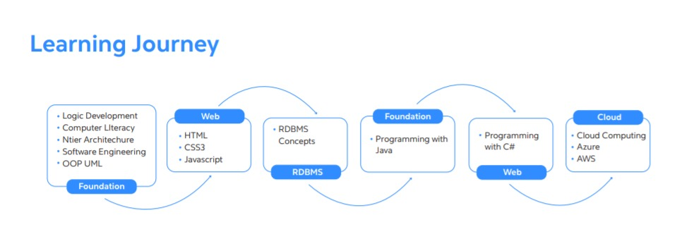

##### Started a #100daysofchallenge for #placement'22

 # :gift: #100daysofchallenge :gift:
 
📒 This repository consists of my daily learning challenge with a short notes. 
📘 The roadmap for this repository has followed the path of 'cognizant: Digital Nurture program'. 
📚 About the material :: The material has been taken and combined from various different sources.
 
   
# 🚀 Getting Started
 

 

## 🏆 Some of My preperation sources:
 
📒 [LeetCode](https://leetcode.com/)\
📒 [Hackerrank](https://www.hackerrank.com/)\
📚 [GeeksforGeeks](https://www.geeksforgeeks.org/) \
📚 [Interview Puzzles](https://www.geeksforgeeks.org/category/puzzles/) \
🤝 [Telegram channel](https://t.me/joinchat/IU7aAON-6bA5MTZl/)

   
 
 

👨🏻‍💻 #100DaysOfchallenge 
📝 Resources are added in repository as per daily challenges ... 
🤝 Sharing my everyday learning on Twitter to stay committed towards my own growth. 
